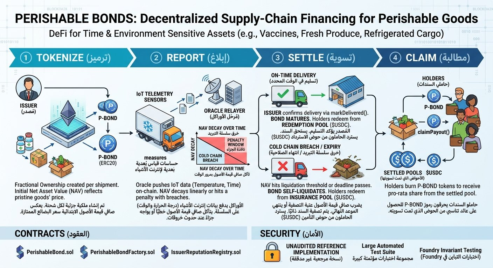

<p align="center">
  
</p>

# Perishable Bonds

[](../../actions/workflows/test.yml)
[](LICENSE)
[](foundry.toml)

Decentralized supply-chain financing for goods that lose value over time —
insulin, vaccines, fresh produce, refrigerated cargo. Traditional Real World
Asset (RWA) tokenization assumes assets hold or appreciate in value; this
protocol treats **time and environmental exposure as active variables** that
erode an asset's on-chain value, and settles automatically instead of through
paperwork and claims adjusters.

> **Status: unaudited reference implementation.** See
> [SECURITY.md](SECURITY.md) before using this with real value.

## How it works

1. **Tokenize** — an issuer creates a `PerishableBond` for one shipment: an
   ERC20 whose supply represents fractional ownership, with an initial Net
   Asset Value (NAV) reflecting the pristine goods' market price.
2. **Report** — an oracle relayer pushes IoT telemetry (temperature, time)
   on-chain via `reportTelemetry()`. NAV decays linearly over time and takes
   an additional hit each time a cold-chain breach persists past a
   configurable grace window.
3. **Settle** — one of two things happens before the deal's `maturityDeadline`:
   - The issuer confirms on-time delivery (`markDelivered()`) → bond
     **matures**, holders redeem pro-rata from a `redemptionPool`.
   - NAV crosses the liquidation threshold, or the deadline passes
     undelivered → bond **self-liquidates**, holders redeem pro-rata from a
     pre-funded `insurancePool`. No adjusters, no disputes.
4. **Claim** — holders burn their tokens for their share via a pull-payment
   `claimPayout()`, at whatever price the bond settled at.

```
Issuer creates bond ──▶ Oracle reports telemetry (loop) ──▶ Settles
       │                        │                              │
  mints ERC20              NAV decays/breaches           Matured or
  to cargo owner            drop NAV live               Liquidated
                                                                │
                                                    Holders claimPayout()
                                                     pro-rata from the
                                                      settled pool
```

## Contracts

| Contract | Purpose |
|---|---|
| [`PerishableBond.sol`](src/PerishableBond.sol) | Per-shipment ERC20 bond: decay curve, oracle intake, auto-liquidation, pull-payment claims. |
| [`PerishableBondFactory.sol`](src/PerishableBondFactory.sol) | Role-gated deployer + on-chain registry of every bond, so front-ends can discover them without indexing events from scratch. |
| [`IssuerReputationRegistry.sol`](src/IssuerReputationRegistry.sol) | Turns every settled bond into a permanent, deal-size-weighted, on-chain credit signal for its issuer — see [below](#issuerreputationregistry). |

### One-call frontend integration

Rendering a bond's dashboard shouldn't take ten RPC calls across
inconsistent block heights. `getSnapshot(address caller)` returns everything
a UI needs in one:

```solidity
struct BondSnapshot {
    Status status;
    uint256 currentNav;
    uint256 initialNavValue;
    uint256 navBps;                 // currentNAV as bps of initialNAV
    uint256 secondsUntilMaturity;
    bool isBreaching;
    uint256 breachSecondsElapsed;
    uint256 cumulativeBreachPenaltyBpsValue;
    uint256 insurancePoolValue;
    uint256 redemptionPoolValue;
    uint256 callerBalance;
    uint256 callerClaimableEstimate; // 0 while Active
    int256 lastTemp;
    uint256 lastReportAge;
}
```

### `IssuerReputationRegistry`

Every cold-chain financing deal today is priced as if the issuer is a
stranger. This registry gives buyers and insurers a verifiable, on-chain
answer to "does this shipper's cargo actually arrive intact?" — a
deal-size-weighted score built entirely from settlement outcomes the chain
already knows are true, not self-reported claims.

```solidity
registry.recordFromBond(bondAddress);           // permissionless, once per bond
registry.reputationScoreBps(issuer);             // 10000 = 100% of settled
                                                  // deal value paid out intact
registry.totalDeals(issuer);                     // distinguishes "no history"
                                                  // from "proven track record"
```

It's a standalone add-on — zero changes to the core bond contract — and only
counts bonds the trusted factory actually deployed (`isRegisteredBond`), and
only credits a `Matured` bond for the portion of its redemption pool that was
actually funded, so an issuer can't farm score from a delivery nobody got
paid for.

## Quickstart

Requires [Foundry](https://getfoundry.sh).

```bash
git clone https://github.com/OWNER/perishable-bonds.git
cd perishable-bonds
forge install foundry-rs/forge-std@v1.9.6 OpenZeppelin/openzeppelin-contracts@v5.3.0
forge build
forge test
```

## Testing

93 tests across 4 suites — unit, factory, integration/reputation, and a
Foundry **invariant** (stateful fuzzing) campaign:

```bash
forge test                      # everything
forge test --match-contract PerishableBondInvariantTest -vv   # invariants only
forge coverage --report summary
```

The invariant suite (`test/invariant/`) drives ~200,000 randomized calls per
run — telemetry reports, pool funding, delivery confirmation, upkeep, claims,
transfers, time warps, in random order and amounts — and checks five
system-wide properties hold no matter what sequence occurs: settlement status
never reverses, no claim ever exceeds its settled pool, the contract always
holds enough to pay remaining claims, `totalSupply` only shrinks, and
`currentNAV()` never reverts.

Current coverage: **95.9% lines / 84.5% branches** overall (100% on
`IssuerReputationRegistry.sol`).

## Deployment

```bash
export ADMIN_ADDRESS=0x...
export DEFAULT_ORACLE=0x...
forge script script/Deploy.s.sol:Deploy \
  --rpc-url $RPC_URL --private-key $PRIVATE_KEY --broadcast --verify
```

This deploys `PerishableBondFactory` and `IssuerReputationRegistry`.
Individual `PerishableBond` instances are created afterward, per shipment,
via `factory.createBond(...)`.

## Security

See [SECURITY.md](SECURITY.md) for the full audit history (every issue found
and fixed across review rounds, with severity and location), known/accepted
design limitations, and how to report a vulnerability.

## Contributing

Issues and PRs welcome. Please run `forge fmt && forge test` before
submitting, and add a regression test for any bug fix.

## License

[MIT](LICENSE)
